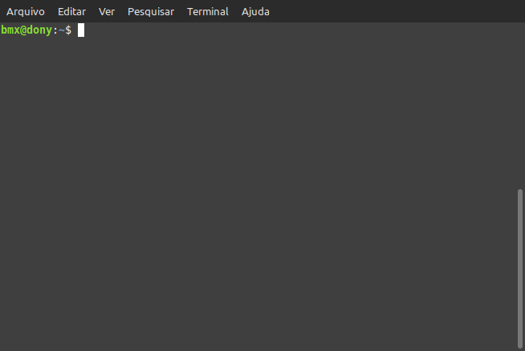

# A simple classification neural network with python (Without libraries)

## About
The neural network I created is capable of classifying numbers from 0's to 1's and this is my first neural network and I decided to create it without using libraries like numpy and tensorflow, and not even pytorch, crazy I know. I used sources like tutorials on youtube, forums and the amazing chatgpt to help me with this new environment where I thought about stepping on neural networks.

 > *This neural network is capable of being trained and spitting out numbers closer to 1's and 0's.*

## Instalation
### No installation needed, just clone the repository or download it as a zip file

#### Clone the repository
```sh
    git clone https://github.com/chmod655/neural-network-from-scratch.git
```

## Usage 
#### Unzip the repository
```sh
    $ unzip neural-network-from-scratch.zip
```

#### Access the repository folder
```sh
    $ cd neural-network-from-scratch
```

Usage is basically starting `main.py`:
```python
    $ python3 main.py
```

#### Example:



## Roadmap
> I believe that for the last addition I will go for data persistence for the neural network and some simple changes

## License
[MIT](https://github.com/chmod655/neural-network-non-worked/blob/main/LICENSE)